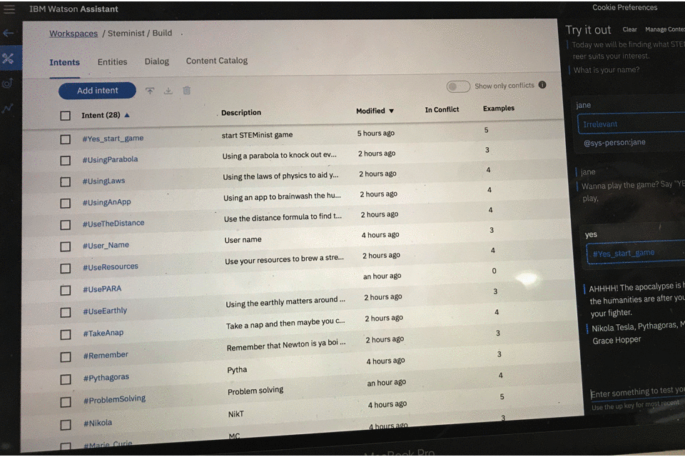
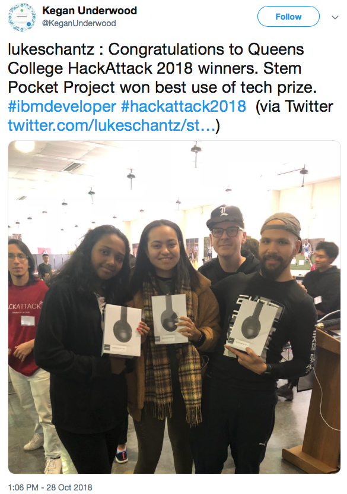

# STEM_PocketProject, QC HackAttack 2018 (tech winner)

**team members**: Pritika Banerjee (project lead, lead programmer), Michelle Abreu (Assistant Project lead), 
Ehson Assani (lead Chatbot programmer)

## Our Goal

### 
Started thinking about college? are you indecisive with degree options? want to change majors? who do you want to become in the next 5 years?  If you have any of these questions, why not try our app, STEM Pocket Project.  Our app was designed on the basics of your interests, regardless of your experience, we will guide you to a career path that more suites who you want to become in the near future.  

    

## The how's and why's

Although the sound of achieving a degree in any of the STEM disciplines may sound appealing.  It does have a negative connotation surrounding the challenges you must overcome.  Soo much so that our project lead, Pritika was scolded for her name and background and told that she would never make it in STEM.  This discouraged her until her 6th grade science teacher guided her in a positive way towards thinking of STEM.  She has since learned python and is motivated to share her great experiences and challenges to others.  You can call our chatbot through your phone and explore the many pathways available to you.  It follows a points chart based on which answers you pick and will advise you on your way, all while entertaining you with scientific facts.

## Results:

While my teammates were working on the backend in python, I attended workshops to figure out how could we best sell our app.
While talking about our presentation with my teammates, I decided to also attended IBM watson conference later in the night.  Up to this point I was not enthralled with what I have seen, however the Watson chatbot api sold me.  Then many many hours later and no sleep in sight, I managed to cobble up a working chatbot with Watson (Ran into many server side issues such as not being able to connect to USEAST).  It was not fully fledged and ready for market, but it did work, and fortunately it wowed the judges.

    

